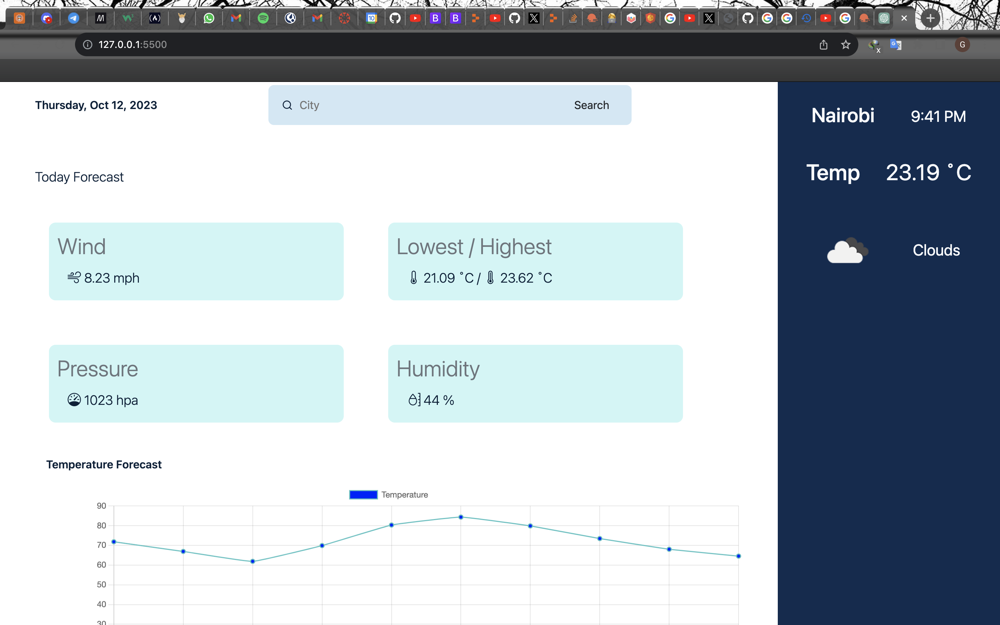

 # WEATHER APP

A simple weather application that is user-friendly and users can be able to search current weather data of any city around the world. The user is also able to get real-time dates and current time zones from the searched city.

The data is from Openweather APIs.

#### By **George** created on, 12th Oct 2023

## Screenshot
   


## Table of Content

- [Description](#description)
- [Design](#design)
- [Behavior of the website](#siteBehavior)
- [Development and set up](#setUp)
- [Prerequisites](#Prerequisites)
- [Live link](#Live-Link)
- [Technology Used](#technology-Used)
- [Licence](#licence)
- [Authors Info](#Authors-info)

## Description

This is a weather application showing current weather forecast. By default it displays weather data of Nairobi. The application uses HTML, CSS and JS in development.

## Design

https://getbootstrap.com/docs/5.3/getting-started/introduction/

## Behaviour of the website
### View
+ The website is visually appealing


## Development and Setup.

Run this command to get the backend started from a realtime API:

https://api.openweathermap.org/data/2.5/weather?q={city name}&appid={API key}

Test your server by visiting this route in the browser:
+ Make sure you register first so that you access API key from the data source.
+ Inside {city name} enter your preferred city to view data from the server

### prerequisites
+ First clone the project to your computer. ```git clone <repo url>```
+ Ensure you have text editor such as Vs code installed.
+ Extract the files and open them in the editor.
+ Run the index.html file in your browser.


### Live Link
* The live link for the project is https://ohthebrave.github.io/weather-app/

## Technology and Tools Used

+ HTML5
+ Bootstrap5
+ CSS5
+ APIs
+ jQuery
+ JavaScript
- Git - Version control
- Vs code- Code editor


## Licence
MIT License

Copyright (c) [2023] [George]

Permission is hereby granted, free of charge, to any person obtaining a copy
of this software and associated documentation files (the "Software"), to deal
in the Software without restriction, including without limitation the rights
to use, copy, modify, merge, publish, distribute, sublicense, and/or sell
copies of the Software, and to permit persons to whom the Software is
furnished to do so, subject to the following conditions:

The above copyright notice and this permission notice shall be included in all
copies or substantial portions of the Software.

THE SOFTWARE IS PROVIDED "AS IS", WITHOUT WARRANTY OF ANY KIND, EXPRESS OR
IMPLIED, INCLUDING BUT NOT LIMITED TO THE WARRANTIES OF MERCHANTABILITY,
FITNESS FOR A PARTICULAR PURPOSE AND NONINFRINGEMENT. IN NO EVENT SHALL THE
AUTHORS OR COPYRIGHT HOLDERS BE LIABLE FOR ANY CLAIM, DAMAGES OR OTHER
LIABILITY, WHETHER IN AN ACTION OF CONTRACT, TORT OR OTHERWISE, ARISING FROM,
OUT OF OR IN CONNECTION WITH THE SOFTWARE OR THE USE OR OTHER DEALINGS IN THE
SOFTWARE.

## Author's info
Linked in - [George Nyanjui]